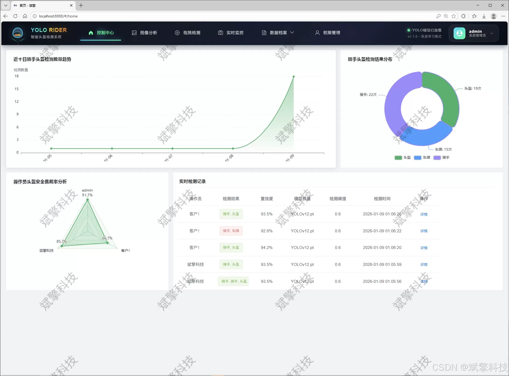
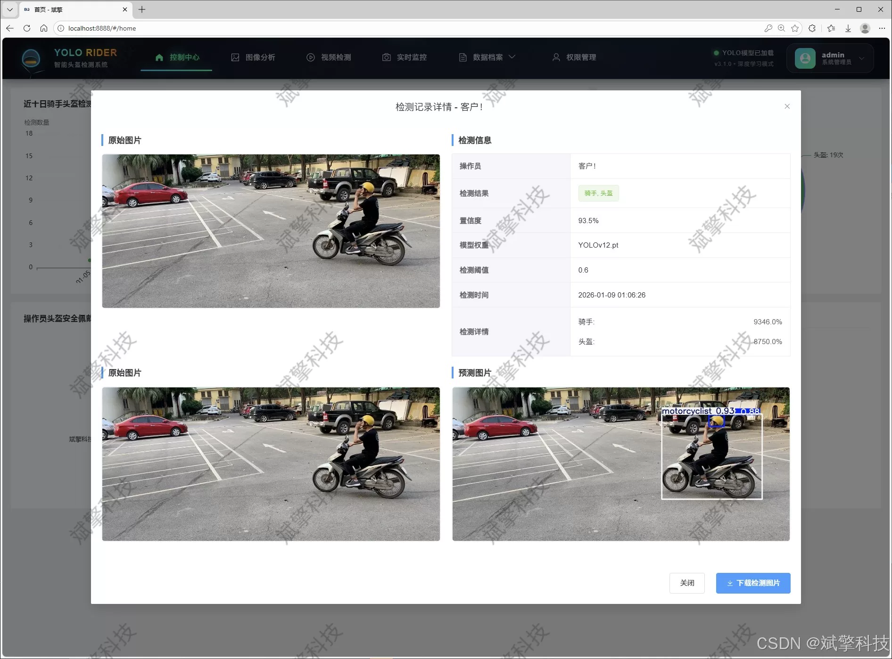
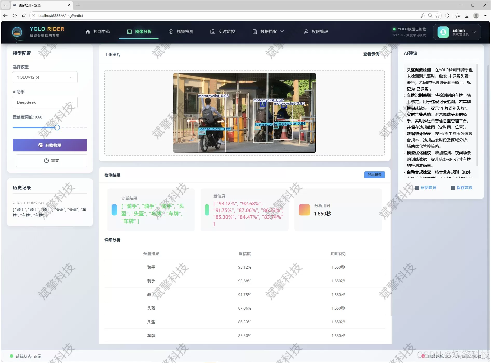
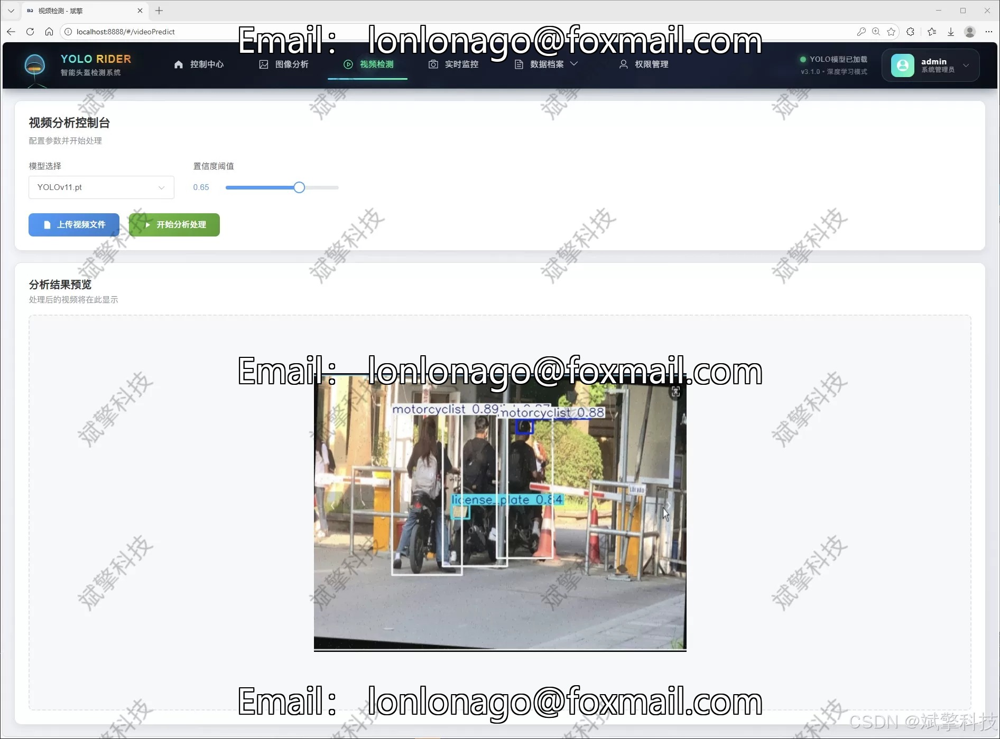
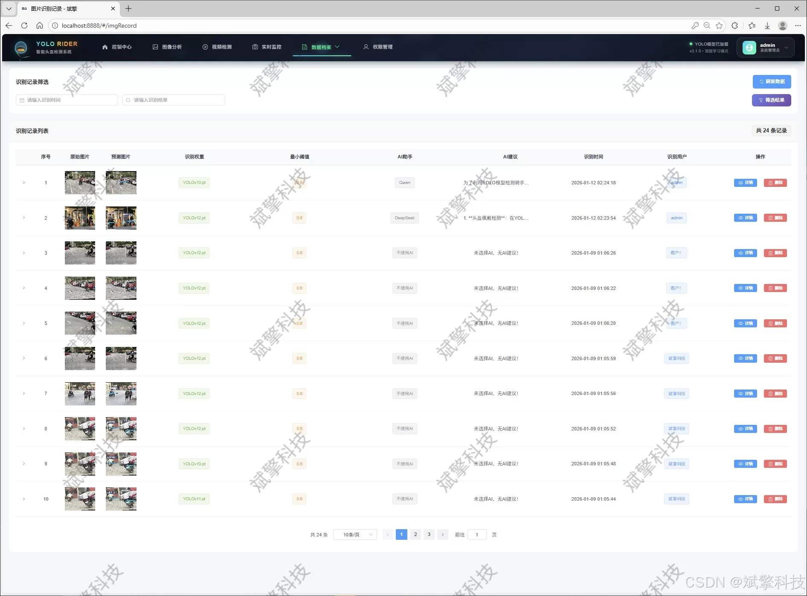
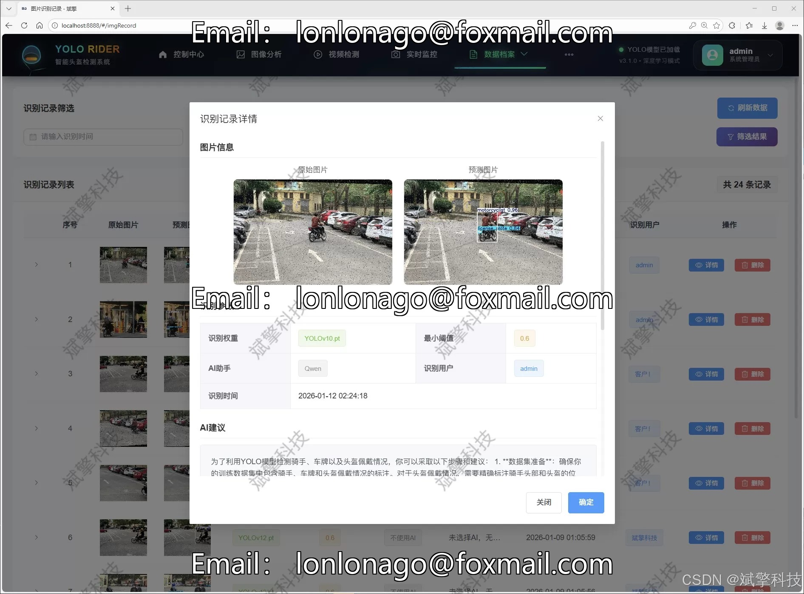
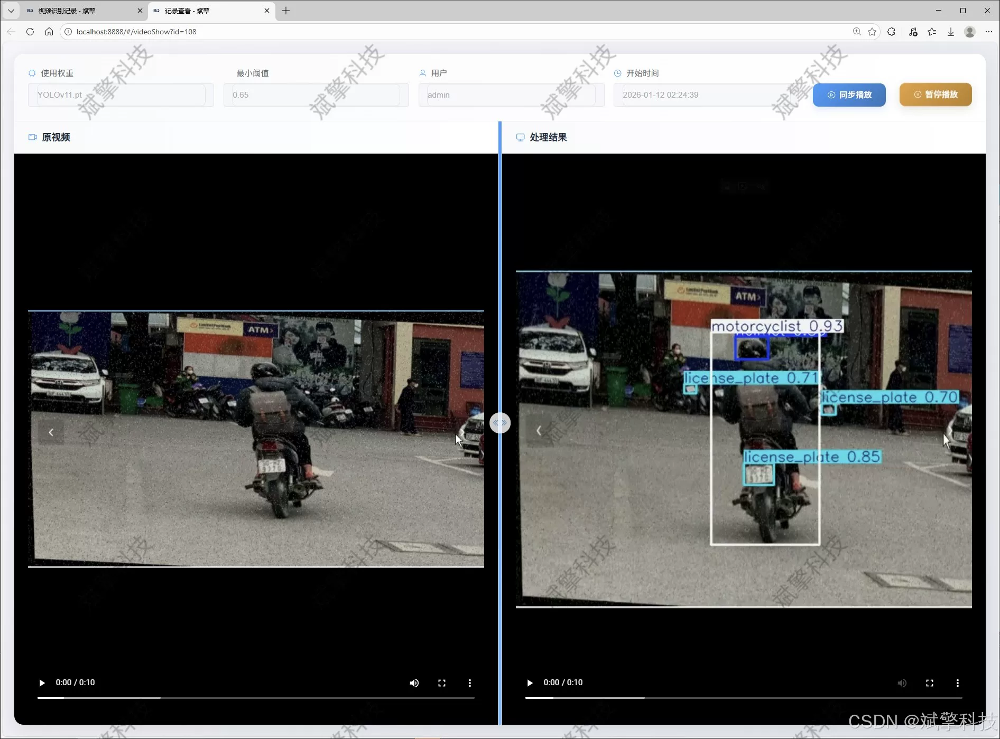
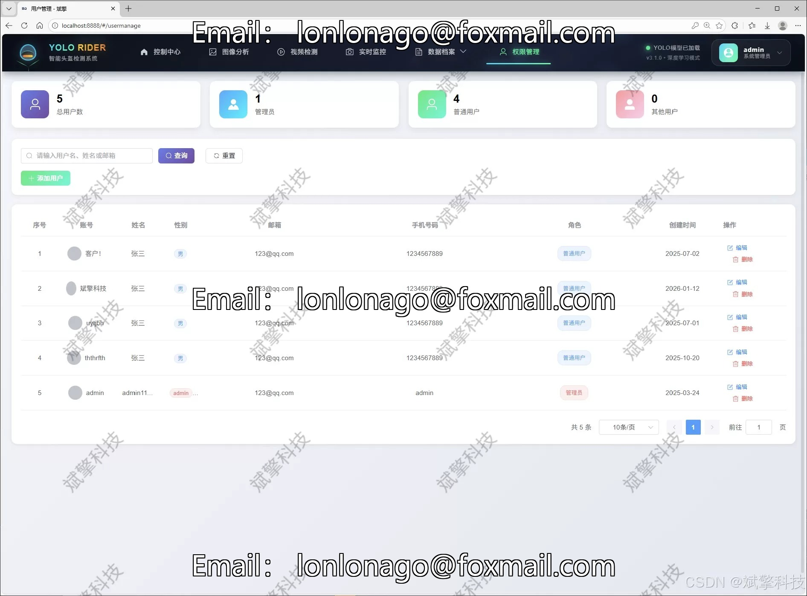

# YOLO rider helmet detection

## Body

YOLO (You Only Look Once) is a deep learning-based object detection algorithm that can detect objects in real-time. It has been widely used in autonomous driving and robotics fields.

In the context of YOLO, "detecting" refers to identifying and classifying objects in the image or video data. For example, if a YOLO model is trained to recognize and classify motorcycles, it can be used to identify and classify motorcycles in real-time.

When a YOLO model is used for motorcycle detection, it typically involves the following steps:

1. Preprocessing: The input image or video data is preprocessed to remove noise and artifacts. This may include resizing, normalization, and other image processing techniques.

2. Feature extraction: The preprocessed image or video data is fed into the YOLO model, which extracts features from the data. These features are then used to train the model on a dataset of motorcycle images.

3. Training: The trained YOLO model is used to predict the presence of motorcycles in new images or videos.

4. Detection: The YOLO model is used to detect the presence of motorcycles in real-time. This involves comparing the extracted features with those of known motorcycle images and classifying them as either a motorcycle or not a motorcycle.

5. Post-processing: If the YOLO model detects a motorcycle, it may also perform additional post-processing steps such as tracking the motorcycle's movement or adjusting its pose based on the detected position.

(Full product description was not available from the source page.)

## Images

## Payment

Here is a pay link on Stripe ( https://buy.stripe.com/3cs8yP7sY87d0vu9AB ). Please contact me lonlonago@foxmail.com after funding $89, and I will send you a complete data files , thank you!

